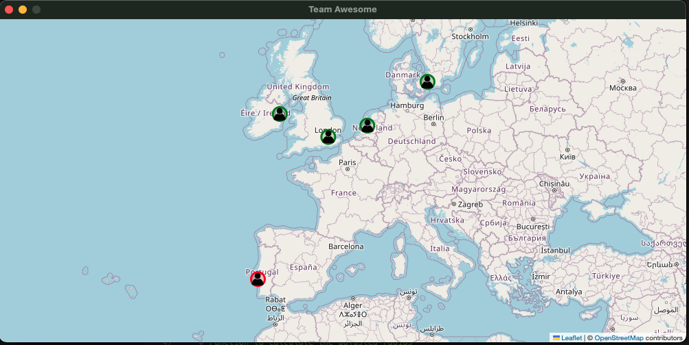

# Team Calendar
This app is intended to give a quick overview of your team members, and what time it is for them. It's intended to be used by teams to avoid communication outside of office hours. 


To get started, rename the [configuration file](config/config.default.json) to config.json and update the file to correspond with your team layout. 

For valid timezones, run the following command:

```
import pytz

for tz in pytz.all_timezones:
    print(tz)
```